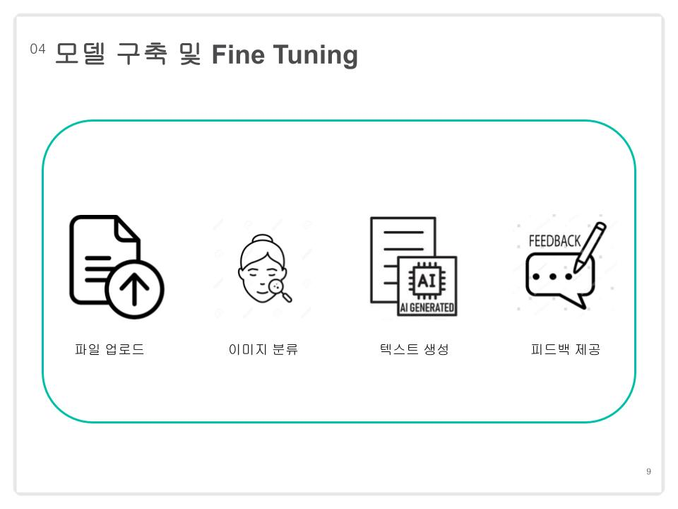
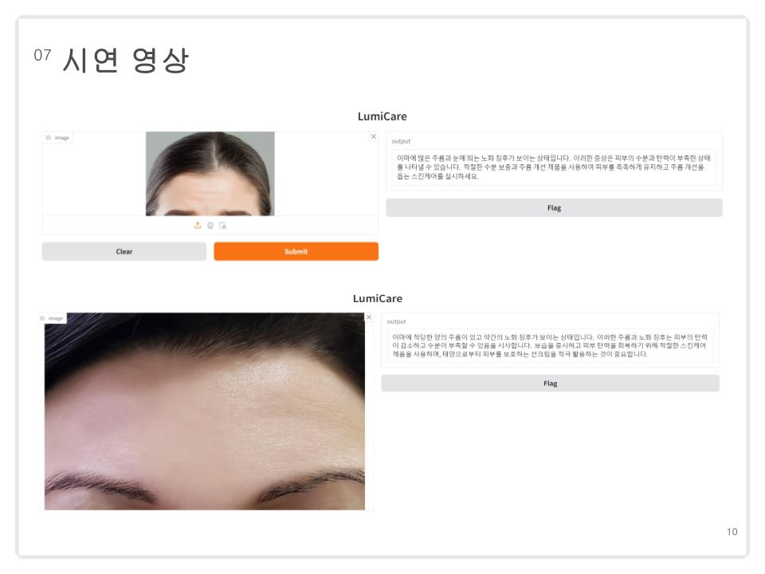

# 교육 과정 2st 팀 프로젝트 :pushpin:
## 개발일정 :triangular_flag_on_post:
<b>2024년 10월 8일 ~ 2024 10월 11일</b>
## LumiCare 피부 진단 서비스

## :soccer: 프로젝트 선정 이유
데이터와 모델일 잘 구축되어 있는 것 같아서 얼굴 이미지에서 여러 분류 라벨 결과를 바탕으로 LLM을 활용하여 개인 맞춤형 피부 진단을 해주고 싶었다.

## ✅ 기획 의도

  
상세 정보

  

## ✅ 초기모델 및 데이터

  
상세 정보

  
  
  
  
  

## ✅ 수정한 모델 및 데이터

  
상세 정보

  
  
  
  

## ✅ 시연결과

  
상세 정보

  
  

## ✅ 기대효과 및 보완사항

  
주요 기능

  
  

  

## ✅ 프로젝트 회고
짧은 기간이었지만 ResNet50, DINOv2를 다뤄 볼 수 있어서 좋았다.
처음 선정한 모델에서 원하는 결과를 얻지 못해서 아쉬움이 남지만
문제를 해결하기 위해 데이터를 분석해본 과정도 기억에 남고
짧은 기간동안 목표를 바꿔서 이마 이미지에 집중하여 결과는 낸 부분에 의미를 두며 다음에는 LLM Fine Tuning에 집중해보고 싶다.

